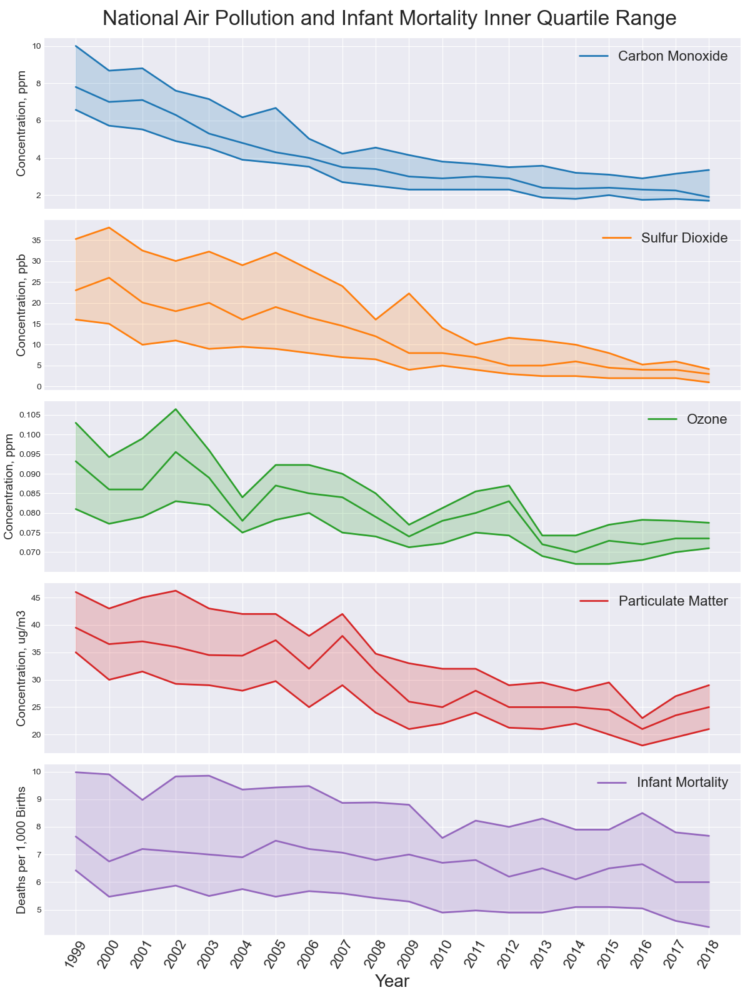

# Air Pollution and its Health Effects in the United States
### Ryan Blauwaert

## Background
---
For centuries, air pollution has been an accepted consequence of productivity and economic developent. Only in the last few decades have we begun to understand the 
* State the practical application of this analysis
* Describe the difficulty of measuring the effects of air pollution
* Pinpoint health outcomes as focus of analysis
* Describe the rationale behind using infant mortality and child asthma hospitalization rates as a proxy for the health effects on the general population

## The Data
The U.S. Environmental Protection Agency (EPA) collects and compiles air quality metrics
* Air pollutant data
    - comes from the EPA
    - give number of metrics in data; describe as annual averages adjusted for seasonal fluctuation
    - across n cities over 20 years
    - describe the metrics which will be the primary focus of the study; give units
* Infant mortality data
    - stress that this is a rate per 1000 births to adjust for differences in location populations
    
* NYC asthma hospitalizations
    - again, this is a rate, this time per 10,000
    - data only available for New York City
    - will test for statistical significance to see if the conclusion about nyc are safe to extend nationally (?)

## Questions
* Is there a statistically significant correlation between air quality and infant mortality?
* Is there a statistically significant correlation between air quality and asthma hospitalizations in New York City?
* Which, if any, air pollutants are most positively correlated with health outcomes?
* Based on the concentrations of significantly correlated pollutants, can an individual who values their respiratory health make an informed decision regarding where to live?

## Cleaning the Data
* Describe goals of cleaning:
    - address null values
    - narrow scope of study to only major US cities
* Challenges in cleaning data:
    - Data coming from three unrelated sources, therefore data is in particularly disparate formats
    - standardize location names to act as indices
    - infant mortality data contained a gap; no data in 2007, 2008. Describe how this was addressed
    - describe transposition of data from one source to match the format of the others

## EDA 
* Look for outliers??
* Show line graphs with all metrics included
    - describe need to narrow focus to a few metrics only
* correlation matrix of pollutants vs pollutants (use means?)

## Visualizations

* National data inner quartile range
    - highlight negatively sloped trendline across all featured metrics as well as infant mortality

