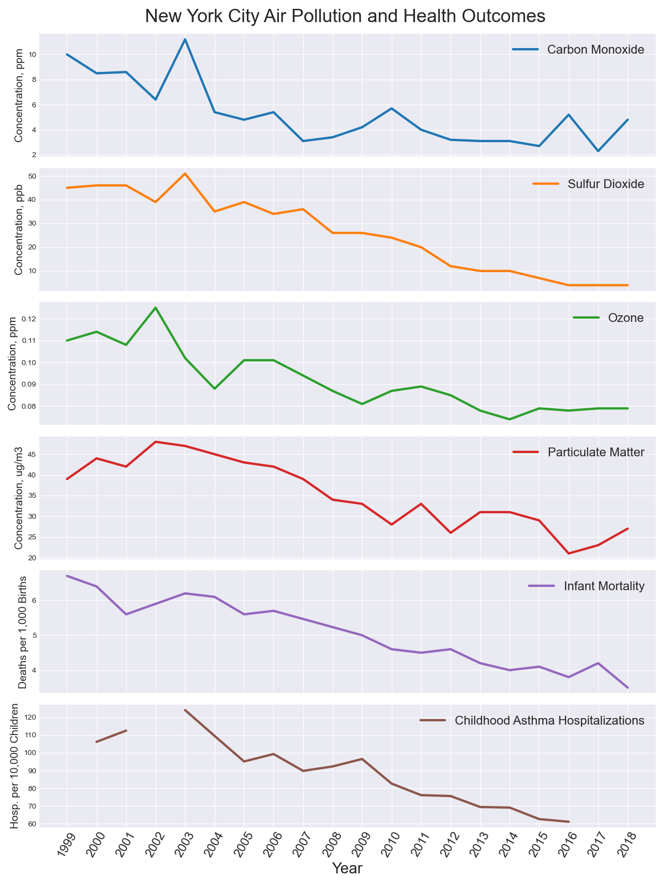
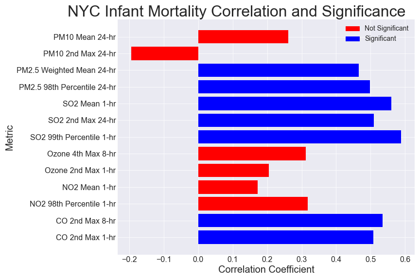
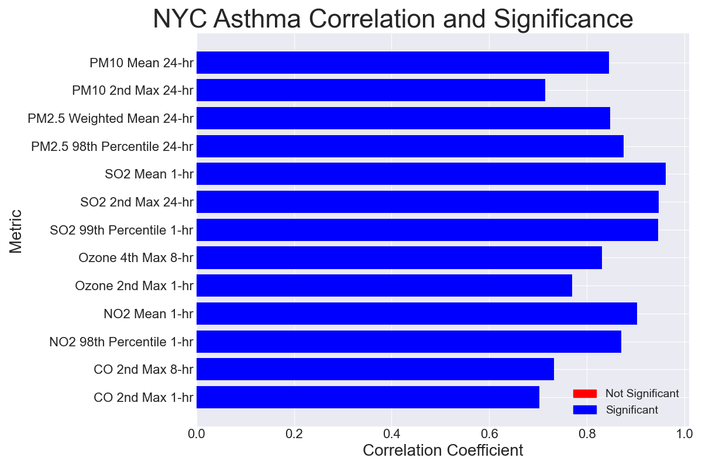
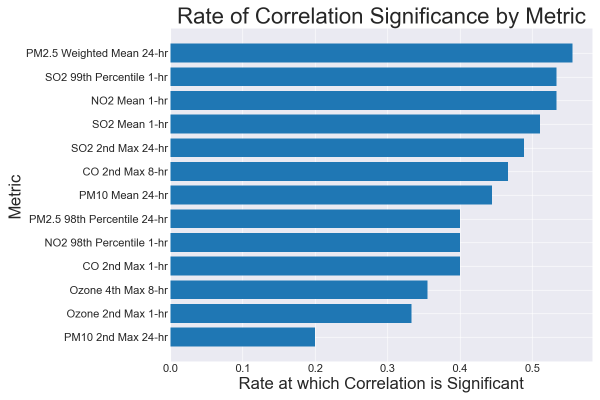

# Air Pollution and its Health Effects in the United States
### Ryan Blauwaert

## Background

Reducing air pollution is extremely costly. In 2005, the Environmental Protection Agency estimated firms across the U.S. spent $20.7 billion on pollution abatement. As the public increases its awareness of environmental issues, we may expect increased demand for firms to reduce pollution. In order to better allocate funds for pollution abatement, we need to understand which pollutants have the largest effects on public health. By analyzing the prevalence of several air pollutants across major U.S. cities as well as health outcomes in these cities, we may be able to simultaneously save money and improve public health.

Measuring the health effects of pollution is inherently difficult. The consequences of exposure to low-quality air may take decades, if not a lifetime, to manifest in an otherwise healthy adult. Additionally, these effects are often masked by other factors (e.g. occupational hazards, cigarette smoking). One way to minimize these difficulties is to study the health of infants or children, for whom environmental factors comprise a larger proportion of health risk. In the analysis that follows, I will be exploring the relationships between air quality, infant mortality, and asthma hospitalizations. 

## The Data
The data used in this analysis comes from three primary sources:
1. **The U.S. Environmental Protection Agency (EPA)**
    - From the [EPA website](https://www.epa.gov/outdoor-air-quality-data/air-quality-statistics-report), I gathered twenty csv files, each containing air quality data from a single year
    - Each csv file contains metrics from approx. 500 locations across the U.S.
    - Air quality metrics include:
        - Carbon Monoxide concentration, ppm
        - Sulfur Dioxide concentration, ppb
        - Ozone concentration, ppm
        - Particulate Matter concentration, ug/m3
2. **KIDS COUNT Data Center**
    - From the [KIDS COUNT website](https://datacenter.kidscount.org/data/tables/6051-infant-mortality?loc=1&loct=3#detailed/3/10,55-56,58-61,64-77,79-84,86,88-94,96-109,9428-9429/false/37,871,870,573,869,36,868,867,133,38/any/12718,12719), I downloaded a single csv file which contains:
        - Data from approx. 50 U.S. cities tracking infant mortality trends from 1999 to 2018
        - Data is provided as both raw quantities and infant mortality rate per 1,000 births
3. **Citizens' Committee for Children of New York (CCC)**
    - The [CCC website](https://data.cccnewyork.org/data/table/7/asthma-hospitalizations#7/12/20/a/a) provides data regarding asthma-related hospitalizations of children in New York City
        - This data is split between children ages 0-4 and children ages 5-17
        - For consistency with infant mortality rates, only data from the 0-4 years age group will be used
        - Rates shown are hospitalizations per 10,000 children in the age range

## Questions
Questions of particular interest for this analysis are:
1. Are there any overall air quality trends which can be seen across the U.S.?
2. Is there a statistically significant correlation between air quality and infant mortality?
3. Is there a statistically significant correlation between air quality and asthma hospitalizations in New York City?
4. Which, if any, air pollutants are most often significantly correlated with health outcomes?

## Exploratory Data Analysis
### Cleaning the Data

Cleaning and organizing this collection of data proved to be particularly challenging for a number of reasons. Here, I'd like to briefly highlight a few of these challenges and offer an explanation for how each was addressed. 
- Formatting of data from each source was significantly different: 
    - Location names had to be standardized via numerous string operations for the sake of consistency 
    - Air quality data needed to be transposed so that its columns would match those of the infant mortality and asthma datasets
- Missing Values
    - Air quality data contained a significant proportion of missing and non-numeric values which were converted to `np.nan` values for ease of mathematical operations
    - Infant mortality data was missing values for all but one city in 2007 and 2008
        - This caused mean values to skew wildly for these years and, left unaddressed, would have resulted in significant issues when studying correlation
        - Values were input for these columns using a linear connection between 2006 and 2009 values to minimize any skew caused by this missing data

### Visualizing the Data
Initially, my goal was to see if there are any visible trends in air quality and/or infant mortality rates over time. Because the data is extensive, I started by using a simple boxplot comparison of the distribution of each pollutant in 1999, 2009, and 2018. An example of a typical result is seen below:

While not visually impactful, this process allowed me to gain a cursory understanding of the trends I could expect for each pollutant.

In order to better visualize the national trends, I decided to plot the concentrations of pollutants as well as infant mortality rates over the twenty years from 1999 to 2018. I used the 25th, 50th, and 75th percentiles for each metric, plotted together to show the interquartile range:

**Good News!**
Based on the negatively sloping interquartile ranges in the graphic above, it appears that the concentration of these pollutants is decreasing across the cities from which the metrics were collected. Additionally, it is interesting to note that the distribution of these pollutant concentrations is shrinking. One possible explanation for this could be that polluters are adhering more closely to national regulations as time goes on, though this hypothesis would require further research to test.

Next, I looked at the trends of these same metrics in New York City, as well as the annual asthma hospitalization rate for children between the ages of 0 and 4.

Again, we can see a generally negative trend for each of these metrics over time, despite a spike occuring around 2002. Asthma hospitalization data was not available for the year 2002 and therefore was not plotted. 

I then calculated the correlation coefficient for each pollution metric with respect to infant mortality and then to asthma hospitalizations. For each of these correlation coefficients, I conducted a t-test to evaluate its significance. The conditions of the t-test were:
- Null Hypothesis: The correlation between the two variables is not significant
- Alternative Hypothesis: the correlation between the two variables is significant
- An alpha value of 0.05 was selected as a threshold for significance
- An n value of 20 was set based on the number of years used to calculate the correlation coefficient
- A two-tailed test was conducted with n-2 degrees of freedom

The correlation coefficients and their significance for each metric can be seen below:

Based on the findings above, there is a statistically significant correlation between infant mortality and several pollutants, notably Sulfur Dioxide, Carbon Monoxide, and PM2.5 Particulate Matter. Additionally, all air quality metrics are significantly correlated with asthma hospitalizations, with the sole exception of Lead. 

Does this level of significant correlation hold true for other U.S. cities? To find out, I followed the same steps for Denver, Colorado. The results can be seen below:

The figure above shows that there is significantly more year-over-year variability in these air pollution metrics. Some appear to be trending downward, while others are too inconsistent for any trend to be assessed visually. However, it is important to note that infant mortality rates in Denver are *also* less consistent than in New York. Could the same levels of correlation and significance seen in New York hold true in Denver?

Based on the same t-test conducted for New York, it appears that the answer is no. In fact, only one measure of Sulfur Dioxide is significantly correlated with infant mortality in this case. 

The figure below shows the rate at which each pollution metric was found to be significant across all cities included in the study.

## Conclusions

Based on the air pollutant metrics included in this study, air quality appears to be improving across the United States. That said, air quality trends are highly variable between cities. In terms of correlation between air pollutant concentrations and public health, the results are inconclusive. In some cities, like New York, there is a statistically significant correlation between many air pollutants and infant mortality, while in others, like Denver, this is not the case. One possible explanation for this could be that in some U.S. cities, other factors (e.g. socioeconomic) dilute and/or overpower any correlative relationship between air quality and infant mortality. 

While no causal relationship between air quality and public health can be inferred based on this study, it may be used as basis for further research. Given the findings in the 'Rate of Correlation Significance by Metric' figure shown above, policy-makers and firms concerned with reducing environmental damages should further investigate PM2.5 Particle Matter, Sulfur Dioxide, and Nitrogen Dioxide. Additionally, this figure shows that *mean* pollutant concentrations are more often significantly correlated with health outcomes than are short-term maxima. Again, further scientific study should be conducted to determine if any causality exists. 

## Citations
- Outdoor Air Quality Data. (2020, June 08). Retrieved February 16, 2021, from https://www.epa.gov/outdoor-air-quality-data/air-quality-statistics-report
- Infant mortality: Kids count data center. Retrieved February 17, 2021, from https://datacenter.kidscount.org/data/tables/6051-infant-mortality
- Keeping Track Online - Asthma Hospitalizations. Retrieved February 17, 2021, from https://data.cccnewyork.org/data/table/7/asthma-hospitalizations