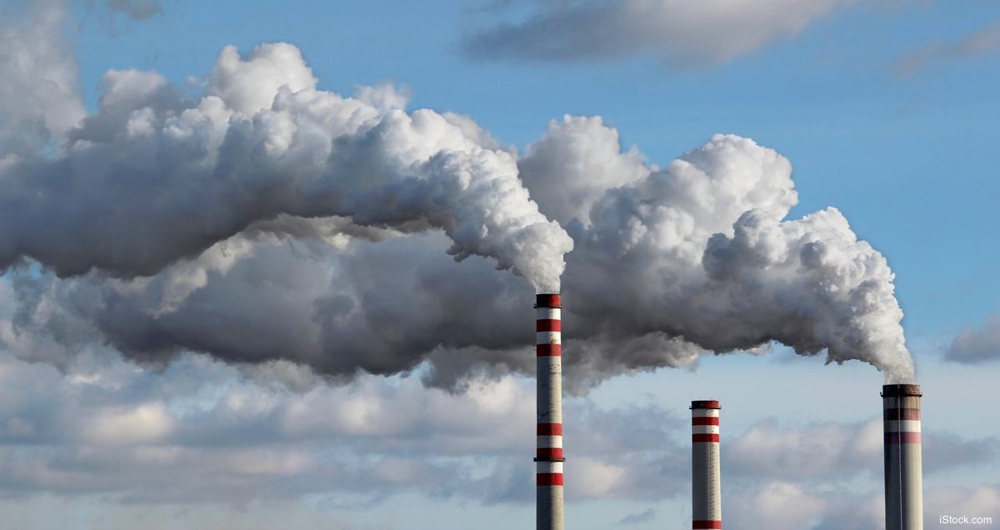

# Air Pollution and its Health Effects in the United States
### Ryan Blauwaert

## Background

Reducing air pollution is extremely costly. In 2005, the Environmental Protection Agency estimated firms across the U.S spent $20.7 billion on pollution abatement. As the public increases its    In order to better allocate funds for pollution abatement, we need to understand which pollutants have the largest effects on public health. By analyzing the prevalence of several air pollutants across major U.S. cities as well as public health outcomes in these cities, we may be able to .....

Measuring the health effects of pollution is inherently difficult. The consequences of exposure to low-quality air may take decades, if not a lifetime, to manifest in an otherwise healthy adult. Additionally, these effects are often masked by other factors (e.g. occupational hazards, cigarette smoking). One way to minimize these difficulties is to study the health of infants or children, for whom environmental factors comprise a larger proportion of health risk. In the analysis that follows, I will be exploring the relationships between air quality, infant mortality, and asthma hospitalizations. 

## The Data
The data used in this analysis comes from three primary sources:
1. **The U.S. Environmental Protection Agency (EPA)**
    - From the [EPA website](https://www.epa.gov/outdoor-air-quality-data/air-quality-statistics-report), I gathered twenty csv files, each containing air quality data from a single year.
    - Each csv file contains metrics from approx. 500 locations across the U.S.
    - Air quality metrics include:
        - Carbon Monoxide concentration, ppm
        - Sulfur Dioxide concentration, ppb
        - Ozone concentration, ppm
        - Particulate Matter concentration, ug/m3
2. **KIDS COUNT Data Center**
    - From the [KIDS COUNT website](https://datacenter.kidscount.org/data/tables/6051-infant-mortality?loc=1&loct=3#detailed/3/10,55-56,58-61,64-77,79-84,86,88-94,96-109,9428-9429/false/37,871,870,573,869,36,868,867,133,38/any/12718,12719), I downloaded a single csv file which contains:
        - Data from approx. 50 U.S. cities tracking infant mortality trends from 1999 to 2018
        - Data is provided as both raw quantities and infant mortality rate per 1,000 births
3. **Citizens' Committee for Children of New York (CCC)**
    - The [CCC website](https://data.cccnewyork.org/data/table/7/asthma-hospitalizations#7/12/20/a/a) provides data regarding asthma-related hospitalizations of children in New York City.
        - This data is split between children ages 0-4 and children ages 5-17.
        - For consistency with infant mortality rates, only data from the 0-4 years age group will be used. 

## Questions
Questions of particular interest for this analysis are:
1. Are there any overall air quality trends which can be seen across the U.S.?
2. Is there a statistically significant correlation between air quality and infant mortality?
3. Is there a statistically significant correlation between air quality and asthma hospitalizations in New York City?
4. Which, if any, air pollutants are most positively correlated with health outcomes?
5. Based on the concentrations of significantly correlated pollutants, can an individual who values their respiratory health make an informed decision regarding where to live?

## Exploratory Data Analysis
### Cleaning the Data
Cleaning and organizing this collection of data proved to be particularly challenging for a number of reasons. Here, I'd like to briefly highlight a few of these challenges and offer an explanation for how each was addressed. 
- Formatting of data from each sources was wildly different 
    - Location names had to be standardized 
    - address null values
    - narrow scope of study to only major US cities
* Challenges in cleaning data:
    - Data coming from three unrelated sources, therefore data is in particularly disparate formats
    - standardize location names to act as indices
    - infant mortality data contained a gap; no data in 2007, 2008. Describe how this was addressed
    - describe transposition of data from one source to match the format of the others

## EDA 
* Look for outliers??
* Show line graphs with all metrics included
    - describe need to narrow focus to a few metrics only
* correlation matrix of pollutants vs pollutants (use means?)

## Visualizations

* National data inner quartile range
    - highlight negatively sloped trendline across all featured metrics as well as infant mortality

## Conclusions

## Directions for Further Research